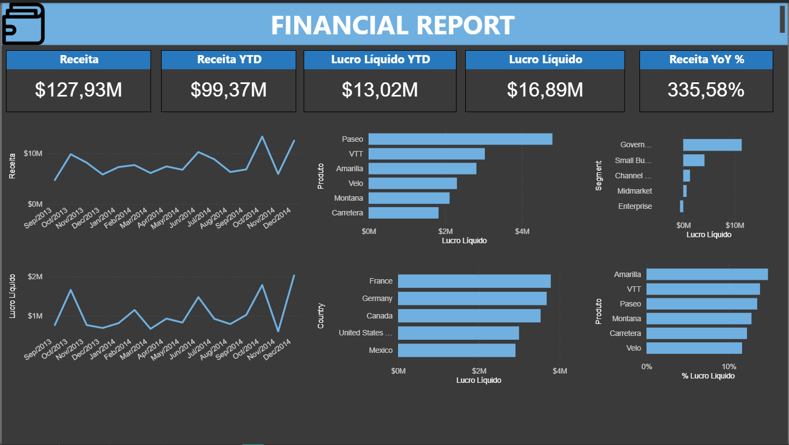
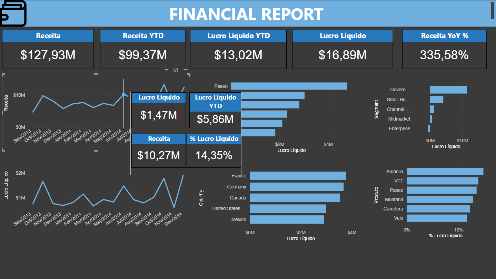

# Financial Performance Dashboard - Power BI

## Overview
Dashboard criada para análise de receitas de uma empresa onde a mesma pode ser utilizada por gestores financeiros e diretores, ajudando os mesmos a tomar decisões conforme a performance de produtos e segmentos lucrativos.

## Objetivo do Projeto
- Monitorar performance financeira
- Análisar lucro ao longo do tempo
- Comparação de produtos, segmentos e países
- Avaliar crescimento (MoM, YoY, YTD)

## DATASET
Dataset proveniente da Microsoft (Microsoft Financial Sample), com aproximadamente 700 registros, possuindo métricas como vendas, lucro, segmento, países e datas.
Dados totalmente fictícios.

## Modelagem de Dados
Utilizado o modelo estrela devido a performance e clareza do modelo, dividindo o dataset inicial em tabelas fato ('F_Financials') e dimensão('D_Country', 'D_Dband', 'D_Product', 'D_Segment') além de criação de utilização de uma tabela calendário ('D_Calendar') para análises temporais.

## Métricas DAX Utilizadas
- Receita
- Receita YTD
- Lucro Bruto
- Lucro Líquido
- Lucro Líquido YTD
- Margens (%)
- Crescimento MoM
- Crescimento YoY

## Principais Análises Disponíveis
- Evolução mensal de Receita e Lucro
- Comparação por Produto
- Comparação por País
- Comparação por Segmento

## Visualizações Utilizadas
Utilizado cards para KPIs importantes devido a importância da métrica, gráficos de linha para análises temporais devido a facilidade de análise de tendências com apoio de tooltips customizados para maior detalhe nas análises e gráficos de barra para melhor comparação entre categorias.

## Ferramentas Utilizadas
- Power BI Desktop
- DAX
- Power Query
- GitHub
- Excel

## Como Utilizar o Projeto
Baixe o arquivo .pbix e abra-o utilizando Power BI desktop, o usuário pode interagir com os visuias e clicar em métricas desejadas nos gráficos de barra ou passar o mouse por cima dos gráficos para análise detalhadas com tooltips.

## Aprendizados
- Aplicação prática de modelagem dimensional (modelo estrela), separando corretamente tabelas fato e dimensões para garantir performance, clareza e escalabilidade do modelo.
- Criação e utilização de uma tabela calendário dedicada, permitindo análises temporais consistentes e corretas, como YTD, MoM e YoY.
- Desenvolvimento de medidas DAX financeiras, incluindo Receita, Lucro Bruto, Lucro Líquido e Margens, priorizando medidas calculadas em vez de colunas prontas do dataset.
- Implementação de análises de crescimento temporal, utilizando funções de inteligência de tempo para avaliar performance ao longo dos meses e anos.
- Uso de tooltips customizados para aprofundar análises sem poluir a visualização principal do dashboard, melhorando a experiência do usuário.
- Organização do layout seguindo boas práticas de data visualization, com foco em KPIs no topo, hierarquia visual clara e escolha adequada de gráficos para cada tipo de análise.
- Desenvolvimento de storytelling orientado ao negócio, transformando dados financeiros em insights acionáveis para gestores e tomadores de decisão.
- Consolidação de boas práticas no uso do Power Query para tratamento e padronização dos dados antes da modelagem.

## Dashboard Online
Acesse a Dashboard interativa clicando aqui: [Clique Para Ver a Dashboard](https://app.powerbi.com/view?r=eyJrIjoiZDE1MzY2YzItOTJlOC00NzM0LWEzNDQtYWE0ZGJjNWMxOGMzIiwidCI6IjM2ODZiNmU4LWI3OTgtNDBkYy04NGI4LTkwOTNkN2FiZWIzYiJ9)

## Dashboard Preview

# English

## Overview
This dashboard was developed to analyze a company’s financial performance and can be used by financial managers and executives to support data-driven decision-making based on the performance of products, segments, and regions.

## Project Objectives
- Monitor overall financial performance
- Analyze profit evolution over time
- Compare products, segments, and countries
- Evaluate growth metrics (MoM, YoY, YTD)

## Dataset
The dataset was provided by Microsoft (Microsoft Financial Sample) and contains approximately 700 records with fictional data, including sales, profit, segments, countries, and dates.

## Data Modeling
A star schema was applied to improve performance and model clarity.
The original dataset was separated into a fact table ('F_Financials') and dimension tables ('D_Country', 'D_DBand', 'D_Product', 'D_Segment'), along with the creation of a dedicated calendar table ('D_Calendar') to support time intelligence analysis.

## DAX Measures Implemented
- Revenue
- Revenue YTD
- Gross Profit
- Net Profit
- Net Profit YTD
- Profit Margins (%)
- Month-over-Month Growth (MoM)
- Year-over-Year Growth (YoY)

## Key Analysis Available
- Monthly evolution of Revenue and Profit
- Performance comparison by Product
- Performance comparison by Country
- Performance comparison by Segment

## Visualizations Used
KPI cards were used to highlight key financial metrics.
Line charts were applied for time-based trend analysis, supported by custom tooltips to provide additional detail without cluttering the main view.
Bar charts were used to enable clear comparisons across categories.

## Tools Used
- Power BI Desktop
- DAX
- Power Query
- GitHub
- Excel

## How to Use This Project
Download the .pbix file and open it using Power BI Desktop.
Users can interact with the visuals by selecting bars or hovering over charts to access detailed insights through custom tooltips.

## Live Dashboard
Access the interactive Power BI dashboard here: [Click to view dashboard](https://app.powerbi.com/view?r=eyJrIjoiZDE1MzY2YzItOTJlOC00NzM0LWEzNDQtYWE0ZGJjNWMxOGMzIiwidCI6IjM2ODZiNmU4LWI3OTgtNDBkYy04NGI4LTkwOTNkN2FiZWIzYiJ9)

## Key Learnings
- Practical application of dimensional modeling (star schema), correctly separating fact and dimension tables to ensure performance, clarity, and scalability.
- Creation and use of a dedicated calendar table to enable consistent and accurate time intelligence calculations such as YTD, MoM, and YoY.
- Development of financial DAX measures, including Revenue, Gross Profit, Net Profit, and Margins, prioritizing calculated measures over pre-existing dataset columns.
- Implementation of time-based growth analysis using DAX time intelligence functions to evaluate performance across months and years.
- Use of custom tooltips to deepen analysis without overloading the main dashboard, improving overall user experience.
- Dashboard layout organization following data visualization best practices, with clear visual hierarchy, KPIs positioned at the top, and appropriate chart selection.
- Development of business-oriented storytelling, transforming financial data into actionable insights for decision-makers.
- Consolidation of Power Query best practices for data cleaning, standardization, and preparation prior to modeling.

